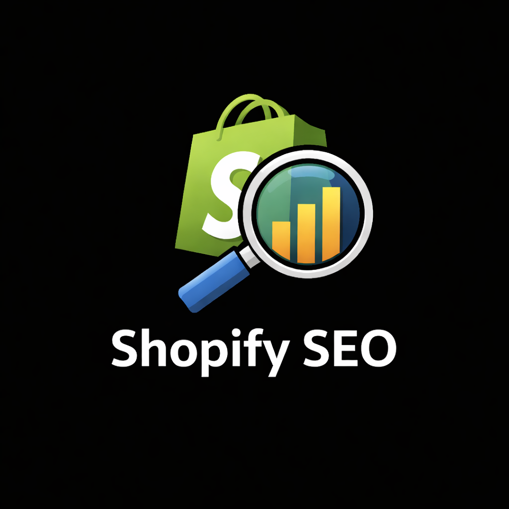

<p align="center">
  
</p>

<h1 align="center">ShopifySEO Pro</h1>

<p align="center">
  <strong>The most comprehensive free SEO analysis tool built specifically for Shopify stores.</strong><br>
  Chrome Extension &middot; 50+ SEO checks &middot; Real Core Web Vitals &middot; Site Crawler &middot; Rank Tracker
</p>

<p align="center">
  
  
  
  
  
</p>

---

## What is ShopifySEO Pro?

ShopifySEO Pro is a Chrome extension that gives you a **full SEO audit** of any Shopify store (or any website) directly in your browser. No account needed, no API keys, no monthly fees. Everything runs locally in your browser.

Unlike other SEO tools that cost $50-200/month, ShopifySEO Pro gives you:

- **50+ SEO checks** across 7 categories
- **Real Core Web Vitals** measurement (LCP, CLS, FCP, TTFB)
- **Full site crawler** via sitemap discovery
- **Google rank checker** with position tracking
- **Competitor comparison** side-by-side analysis
- **Internal link map** visualization
- **Copyable fix code** (Shopify Liquid snippets) for every issue
- **PDF report export** for clients
- **Score history** with trend tracking

All for **$0**. Forever.

---

## Features

### Score Dashboard
Instant SEO health score (0-100) with letter grade. See critical issues, warnings, and passes at a glance. Category breakdown shows exactly where your SEO is strong or weak.

- Overall score with animated gauge
- Issue counts by severity (Critical / Warning / Info / Pass)
- Per-category scores: Meta, Content, Technical, Images, Links, Performance, Shopify
- Score badge on the extension icon per tab

### Meta & Social Analysis
Complete audit of your page's meta tags and social sharing appearance.

- **Editable SERP Preview** — live-edit your title and description with character counters
- Google search result preview (how your page looks in search)
- Social media card preview (Open Graph / Twitter Card)
- Title tag optimization (length, keywords)
- Meta description analysis
- Open Graph tags check (og:title, og:description, og:image, og:url)
- Twitter Card validation

### Content Analysis
Deep dive into your page content quality.

- Word count with thresholds (thin content detection)
- Readability scoring (Flesch-Kincaid algorithm)
- Heading structure tree (H1-H6 hierarchy visualization)
- Top 15 keywords with density percentage and distribution bars
- Keyword stuffing detection
- Paragraph count and sentence analysis

### Technical SEO
Catch critical technical issues that block your rankings.

- Canonical tag validation
- Robots meta (noindex/nofollow detection)
- HTTPS check
- URL structure audit (length, uppercase, underscores, query params)
- Hreflang tags for international sites
- **Structured Data viewer** — browse all JSON-LD blocks with field-by-field view, expandable raw JSON
- Schema validation (Product, BreadcrumbList, Organization, Article)
- Duplicate schema detection
- Favicon check

### Image Audit
Every image on the page analyzed for SEO best practices.

- Alt text audit (missing, empty, descriptive)
- Image format detection (WebP/AVIF/JPG/PNG/SVG)
- Lazy loading coverage
- Width/height attribute check (prevents CLS)
- Clean table view with format, alt, lazy, and dimension badges per image

### Link Analysis
Understand your internal and external link structure.

- Internal vs external link count
- External domain list
- Nofollow audit
- Empty anchor text detection
- Placeholder link detection (#, javascript:void)

### Core Web Vitals (Real Measurements)
Not estimates — actual performance metrics from the browser's Performance API.

- **LCP** (Largest Contentful Paint) — with good/needs-improvement/poor thresholds
- **CLS** (Cumulative Layout Shift)
- **FCP** (First Contentful Paint)
- **TTFB** (Time to First Byte)
- DOM size and depth analysis
- Render-blocking resource count
- Third-party script audit

### Shopify-Specific Checks
15+ checks built specifically for Shopify stores.

- **Product pages**: description word count, image count, review detection, variant canonical issues
- **Collection pages**: description presence, product listing, tag page indexation
- **Blog posts**: article word count, BlogPosting schema, internal link density
- **Theme audit**: breadcrumbs, search functionality, social links, hero image lazy loading, app bloat detection

### Site Crawler
Crawl your entire site to find SEO issues across all pages.

- Automatic sitemap.xml discovery and parsing
- Batch analysis of up to 50 pages
- Site-wide average score
- Worst-performing pages ranked
- Most common issues aggregated across all pages
- Progress bar with real-time updates

### Google Rank Checker
Check where your site ranks for any keyword — no API needed.

- Enter any keyword and see your Google position
- Top 10 search results displayed with your site highlighted
- Position color coding: Top 3 (green), Page 1 (yellow), Page 2+ (red)
- **Rank history** — track position changes over time
- Change indicators showing improvement or decline

### Competitor Comparison
See how your SEO stacks up against any competitor.

- Enter any competitor URL for instant comparison
- Side-by-side score gauges
- Category-by-category comparison bars
- "What they do better" and "What you do better" issue lists
- Identifies specific checks where you're losing

### Internal Link Map
Visual graph of your page's internal link structure.

- SVG visualization with current page centered
- Nodes color-coded by inbound link count
- Directional arrows showing link flow
- Hover tooltips with full path and anchor texts
- Top link targets table with distribution bars
- **Orphan risk detection** — pages with only 1 inbound link

### Fix Code Snippets
Every issue comes with **copy-paste code** to fix it.

- Shopify Liquid code snippets for meta tags, OG tags, schema, etc.
- HTML fixes for missing attributes
- One-click copy to clipboard
- Included in CSV and PDF exports

### Export & Reporting
Share your findings with clients or your team.

- **PDF Report** — styled, printable report with all issues and code fixes
- **CSV Export** — spreadsheet with severity, category, description, recommendations, code snippets
- **Score History** — track improvements over time per domain
- Trend indicators showing score changes

---

## Installation

### From Source (Developer Mode)

1. **Download** this repository:
   ```bash
   git clone https://github.com/aymenhmaidiwastaken/Shopify-Seo.git
   ```
   Or download as ZIP and extract.

2. **Open Chrome** and navigate to:
   ```
   chrome://extensions/
   ```

3. **Enable Developer Mode** (toggle in the top-right corner)

4. **Click "Load unpacked"** and select the `shopify-seo` folder

5. **Done!** The ShopifySEO Pro icon appears in your toolbar.

---

## How to Use

1. **Navigate** to any Shopify store (or any website)
2. **Click** the ShopifySEO Pro icon in your toolbar
3. **Click "Run Analysis"** to start the SEO audit
4. **View results** in the popup for a quick overview
5. **Click "Open Full Analysis"** for the detailed side panel dashboard
6. **Explore tabs**: Meta, Content, Technical, Images, Links, Speed, Shopify, Crawler, Compare, Link Map, Rank

### Quick Tips
- **Re-analyze** after making changes to see score improvements
- **Use the Crawler** to audit your entire site at once
- **Check Rank** for your target keywords regularly
- **Compare** with top competitors to find gaps
- **Export PDF** reports for client presentations
- **Copy fix code** directly into your Shopify theme files

---

## Project Structure

```
shopify-seo/
├── manifest.json              # Chrome Extension manifest (v3)
├── Logo.png                   # Extension logo
├── icons/                     # Extension icons (16/32/48/128px)
│   ├── icon-16.png
│   ├── icon-32.png
│   ├── icon-48.png
│   └── icon-128.png
├── src/
│   ├── content/
│   │   └── index.js           # Content script (1300+ lines)
│   │                          # All analyzers bundled as single IIFE
│   │                          # Shopify detection, CWV, 50+ SEO checks
│   ├── background/
│   │   └── service-worker.js  # Background service worker
│   │                          # Sitemap crawler, page fetcher, alarms
│   ├── popup/
│   │   ├── popup.html         # Quick-view popup UI
│   │   ├── popup.js           # Popup logic
│   │   └── popup.css          # Popup styles
│   └── sidepanel/
│       ├── sidepanel.html     # Full dashboard (13 tabs)
│       ├── sidepanel.js       # Dashboard logic (1600+ lines)
│       │                      # Crawler, compare, link map, rank checker
│       └── sidepanel.css      # Dashboard styles (1300+ lines)
└── README.md
```

---

## SEO Checks Reference

| Category | Checks | What's Analyzed |
|----------|--------|----------------|
| **Meta & Social** | 9 | Title tag, meta description, OG tags, Twitter Cards, viewport, charset, lang |
| **Content** | 8+ | Word count, readability, heading hierarchy, keyword density, stuffing detection |
| **Technical** | 10+ | Canonical, robots, HTTPS, URL structure, hreflang, JSON-LD schema, favicon |
| **Images** | 8+ | Alt text, dimensions, lazy loading, modern formats (WebP/AVIF) |
| **Links** | 5+ | Internal/external count, nofollow audit, empty anchors, placeholder links |
| **Performance** | 12+ | Core Web Vitals (LCP, CLS, FCP, TTFB), DOM size/depth, blocking resources, 3rd party scripts |
| **Shopify** | 15+ | Product descriptions, variant canonicals, collection descriptions, blog schema, breadcrumbs, app bloat |

### Scoring System

| Grade | Score Range |
|-------|------------|
| A+ | 95-100 |
| A | 90-94 |
| B+ | 85-89 |
| B | 80-84 |
| C+ | 75-79 |
| C | 70-74 |
| D | 60-69 |
| F | Below 60 |

**Penalty weights:** Critical = -20 points, Warning = -8 points, Info = -2 points

---

## Technical Details

- **Manifest Version**: 3 (latest Chrome extension standard)
- **No build tools required** — pure JavaScript, load directly as unpacked extension
- **No external APIs** — everything runs client-side in the browser
- **No accounts or signups** — install and use immediately
- **No data collection** — all analysis data stays in your browser's local storage
- **Content Security Policy compliant** — no inline scripts or eval()

### Browser Compatibility
- Chrome 88+ (Manifest V3 support)
- Edge 88+ (Chromium-based)
- Other Chromium browsers (Brave, Opera, Vivaldi)

### Permissions Used
| Permission | Why |
|-----------|-----|
| `activeTab` | Analyze the current page |
| `storage` | Save history and rank tracking data locally |
| `sidePanel` | Full dashboard side panel |
| `scripting` | Inject content script for analysis |
| `alarms` | Scheduled periodic re-analysis |
| `<all_urls>` | Fetch pages for crawler, competitor comparison, rank checking |

---

## Privacy

ShopifySEO Pro does **not**:
- Collect or transmit any personal data
- Send your URLs or analysis results to any server
- Require any account or authentication
- Use any third-party analytics or tracking
- Store data anywhere except your browser's local storage

All processing happens **entirely in your browser**.

---

## Contributing

Contributions are welcome! Here's how:

1. Fork this repository
2. Create a feature branch: `git checkout -b feature/amazing-feature`
3. Make your changes
4. Test by loading as unpacked extension in Chrome
5. Commit: `git commit -m "Add amazing feature"`
6. Push: `git push origin feature/amazing-feature`
7. Open a Pull Request

### Development Setup

No build tools needed. Just:
1. Clone the repo
2. Open `chrome://extensions`
3. Enable Developer Mode
4. Load the folder as unpacked extension
5. Edit files and click "Reload" to test changes

---

## Roadmap

- [ ] Chrome Web Store publication
- [ ] Firefox add-on port
- [ ] Accessibility (WCAG) audit module
- [ ] Multi-language content detection
- [ ] Custom scoring weight configuration
- [ ] Team sharing / cloud sync (optional)
- [ ] Shopify Admin API integration for auto-fixes

---

## License

MIT License. See [LICENSE](LICENSE) for details.

---

<p align="center">
  <br>
  <strong>ShopifySEO Pro</strong><br>
  <sub>Built for Shopify store owners, agencies, and SEO professionals.</sub>
</p>
